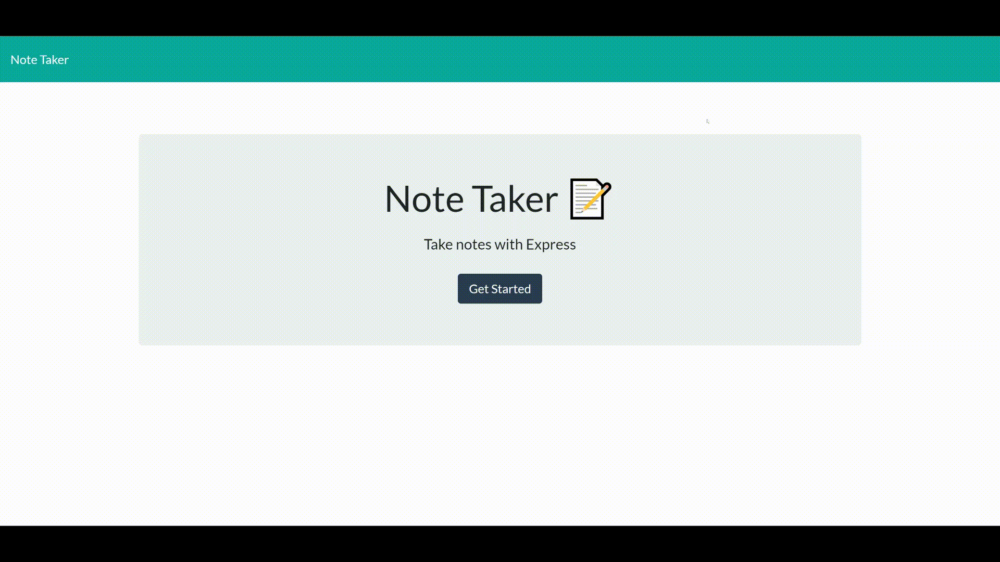

# Express.js Note Taking Application

## Description

A note taking application using Express.JS and deployed to Heroku.
Use the application to organise your working day by creating, viewing, and deleting notes. Enjoy!

---

## Table of Contents

1. [Installation](#installation)
2. [Usage](#usage)
3. [URL](#url)
4. [Build](#build)
5. [License](#license)
6. [Contributing](#contributing)
7. [Tests](#tests)
8. [Questions](#questions)

## Installation

You can run this application locally by:

- Git clone this repository
- Navigate to the directory you cloned it to
- Enter `npm install`
- To start the application server enter: `npm start`
- Navigate to http://localhost:3001 in your browser
- Start making notes

Alternatively, you can use the version hosted on Heroku by navigating to: https://note-taker-hw11.herokuapp.com

## Usage

1. Navigate to: https://note-taker-hw11.herokuapp.com
2. Click the "Get Started" button
3. Add a note by clicking the plus icon in the top right
4. Enter the note title and note text
5. Press the save icon in the top right
6. Delete a note by clicking the red trash can icon next to a note

### Screenshot

## URL

The application is deployed here: https://note-taker-hw11.herokuapp.com

## Build

The following technology stack was used:

- Node.JS
- Express.JS
- Uniqid package (creates a unique string)
- Deployed to Heroku

## License

This project is licensed under MIT.

## Contributing

- Oliver Drew

## Tests

Not applicable to this application.

## Questions

If you have any questions please contact me via [GitHub](https://github.com/oli-drew) or [Email](mailto:oli-webdev@protonmail.com)
